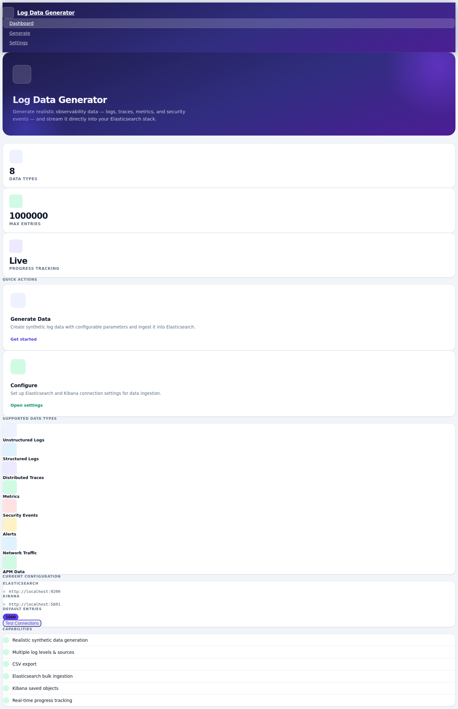
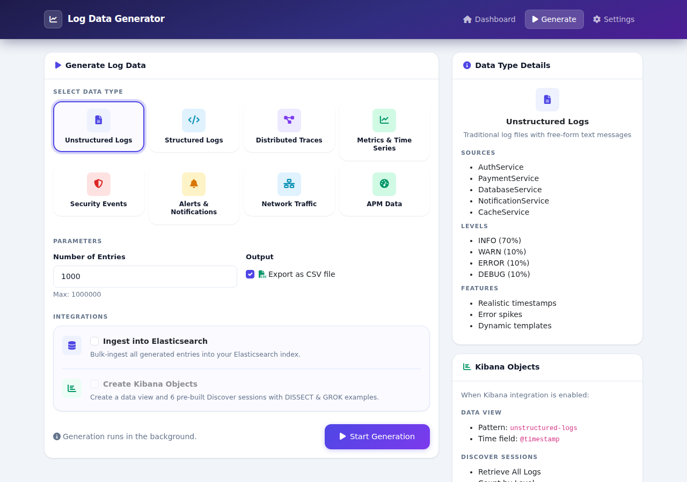
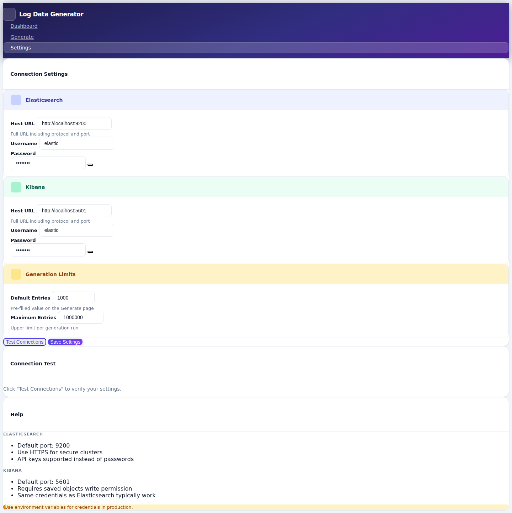

# Multi-Format Data Generator

A powerful tool for generating **8 different types of synthetic observability and security data** with both **command-line** and **modern web interface** options. Generate realistic data for testing, development, and demonstration purposes across the entire observability stack.


*Modern web interface — hero banner, stat cards, and quick-action cards*

---

## 8 Data Types Supported

This project supports **8 comprehensive data types** covering the entire observability and security spectrum:

### Observability Data
- **Unstructured Logs** — Traditional log files with free-form text messages
- **Structured Logs** — JSON-formatted logs with consistent fields and metadata
- **Distributed Traces** — OpenTelemetry-style tracing data showing request flows
- **Metrics & Time Series** — Counter, gauge, histogram, and summary metrics
- **APM Data** — Application Performance Monitoring with transactions and errors

### Security & Infrastructure Data
- **Security Events** — SIEM-style security events with threat intelligence
- **Alerts & Notifications** — Alert manager style alerts with firing/resolved states
- **Network Traffic** — Network flow logs with connection details and protocols

---

## Web Interface

A modern, responsive web UI makes data generation accessible to everyone — no command-line experience required.


*Color-coded data type picker — each category has its own icon and accent color*

### Key Features

- **Modern UI** — Inter font, indigo/violet gradient design system, Bootstrap 5.3
- **Easy Configuration** — Web-based setup for Elasticsearch and Kibana connections
- **Real-time Progress Tracking** — Live progress bar and timeline during generation
- **Connection Testing** — Verify Elasticsearch and Kibana settings before generating
- **Multiple Output Options** — CSV export, Elasticsearch ingestion, and Kibana objects
- **Kibana Dashboards** — One Lens dashboard per data type (7 panels: markdown, metric stats, time-series, donut/bar) created automatically on ingest
- **Streaming Mode** — Continuous data generation at a configurable rate (events/min) with live stats card and start/stop controls
- **Correlated Scenarios** — Three multi-type incident scenarios that generate realistic correlated events across several data types within a shared incident window
- **Generate All** — Single click to populate all 8 data types sequentially
- **Cleanup / Reset** — Delete ES indices or clear CSV files directly from the dashboard
- **Password Visibility Toggle** — Show/hide credentials on the Settings page

---

## Quick Start

### 1. Installation
```bash
git clone https://github.com/ninoslavmiskovic/log-data-generator.git
cd log-data-generator
python3 -m venv venv
source venv/bin/activate  # On Windows: venv\Scripts\activate
pip install -r requirements.txt
```

### 2. Launch Web Interface
```bash
python app.py
```

### 3. Access the Application
Open your browser and navigate to: **http://localhost:8080**

> The app runs on port 8080 by default to avoid conflicts with macOS AirPlay Receiver.

### 4. First-Time Setup
1. **Navigate to Settings** in the navigation bar
2. **Configure your connections** (Elasticsearch host, credentials, Kibana host)
3. **Test connections** to verify everything works
4. **Start generating data**


*Settings page — color-coded sections for Elasticsearch, Kibana, and generation limits*

---

## User Workflows

### Workflow 1: First-Time Setup

1. Launch the application and navigate to http://localhost:8080
2. Go to **Settings** → configure Elasticsearch and Kibana connections
3. Click **Test Connections** to verify
4. Click **Save Settings**

### Workflow 2: Generate Logs (CSV Only)

1. Navigate to **Generate** → set number of entries (1–1,000,000)
2. Enable **Export as CSV file** (checked by default)
3. Click **Start Generation** → watch real-time progress
4. CSV saved to `output_csv/`

### Workflow 3: Full Elasticsearch + Kibana Integration

1. Configure connections in Settings
2. Navigate to **Generate** → set parameters and select a data type
3. Enable all options:
   - Export as CSV file
   - Ingest into Elasticsearch
   - Create Kibana Objects
4. Monitor progress → automatic redirect to the progress page
5. Open Kibana → your data view and Discover sessions are ready

### Workflow 4: Generate All Data Types at Once

1. Navigate to **Generate** → select the **All Data Types** card at the top
2. Set entry count (multiplied across all 8 types) and enable desired options
3. Click **Start Generation** → progress page shows 8 sequential steps
4. Open Kibana → 8 data views, 4–6 Discover sessions, and 1 dashboard each

### Workflow 5: Streaming / Continuous Mode

1. Navigate to **Generate** → expand the **Streaming Mode** sidebar card
2. Choose data type, rate (events/min), and optional max-event cap
3. Click **Start Streaming** → data is ingested in batches at the requested rate
4. Click **Stop Streaming** (or use `ldg stop` from the CLI) to halt

### Workflow 6: Correlated Scenarios

1. Navigate to **Generate** → click a scenario card (Deployment Failure, Security Incident, or Database Slowdown)
2. Set entry count per type and click **Run Scenario**
3. Correlated events are generated across 4–5 data types with a shared incident window
4. Open Kibana → cross-reference the incident across logs, metrics, traces, and alerts

### Workflow 7: Bulk Data Generation

1. Adjust max entries in Settings (up to 10 M entries)
2. Use CSV-only mode for fastest generation
3. Monitor system resources during generation
4. Batch-import to Elasticsearch using separate tools if needed

---

## Generated Data Formats

#### Unstructured Logs
```json
{
  "@timestamp": "2024-03-15T14:30:25.123Z",
  "log.level": "INFO",
  "source": "AuthService",
  "message": "User 'john_doe' logged in successfully from IP address 192.168.1.100"
}
```

#### Structured Logs
```json
{
  "@timestamp": "2024-03-15T14:30:25.123Z",
  "service.name": "user-api",
  "service.version": "2.1.3",
  "log.level": "INFO",
  "environment": "production",
  "trace.id": "550e8400-e29b-41d4-a716-446655440000",
  "http.method": "POST",
  "http.status_code": 200,
  "http.response_time_ms": 145,
  "message": "User profile updated successfully"
}
```

#### Distributed Traces
```json
{
  "@timestamp": "2024-03-15T14:30:25.123Z",
  "trace.id": "550e8400-e29b-41d4-a716-446655440000",
  "span.id": "6ba7b810-9dad-11d1",
  "span.parent_id": "6ba7b810-9dad-11d0",
  "span.name": "user-service.authenticate",
  "service.name": "user-service",
  "span.kind": "server",
  "span.status": "OK",
  "duration.ms": 45
}
```

#### Metrics & Time Series
```json
{
  "@timestamp": "2024-03-15T14:30:25.123Z",
  "metric.type": "counter",
  "metric.name": "requests_total",
  "metric.value": 1547,
  "service.name": "api-gateway",
  "environment": "production",
  "labels": { "method": "GET", "status": "success" }
}
```

#### Security Events
```json
{
  "@timestamp": "2024-03-15T14:30:25.123Z",
  "event.type": "authentication",
  "event.severity": "high",
  "event.action": "login_attempt",
  "event.outcome": "failure",
  "source.ip": "192.168.1.100",
  "user.name": "admin",
  "threat.indicator": "brute_force"
}
```

#### Alerts & Notifications
```json
{
  "@timestamp": "2024-03-15T14:30:25.123Z",
  "alert.name": "HighCPUUsage",
  "alert.state": "firing",
  "alert.severity": "critical",
  "metric.value": 95,
  "metric.threshold": 85,
  "labels": { "service": "database", "environment": "production" }
}
```

#### Network Traffic
```json
{
  "@timestamp": "2024-03-15T14:30:25.123Z",
  "network.protocol": "tcp",
  "source.ip": "10.0.1.100",
  "destination.ip": "10.0.2.200",
  "source.port": 45123,
  "destination.port": 443,
  "network.bytes": 8547,
  "network.direction": "outbound",
  "event.action": "allowed"
}
```

#### APM Data
```json
{
  "@timestamp": "2024-03-15T14:30:25.123Z",
  "transaction.id": "txn-001-2024-03-15",
  "transaction.type": "request",
  "transaction.name": "GET /api/users",
  "service.name": "web-app",
  "transaction.duration.ms": 234,
  "transaction.result": "success",
  "http.method": "GET",
  "http.status_code": 200
}
```

---

## Elasticsearch Indices & Kibana Objects

### Index Patterns Created

| Index | Data Type |
|-------|-----------|
| `logs-unstructured` | Unstructured logs |
| `logs-structured` | Structured logs |
| `traces` | Distributed traces |
| `metrics` | Time-series metrics |
| `security-events` | Security & threat data |
| `alerts` | Alerts & notifications |
| `network-traffic` | Network flow data |
| `apm` | APM transactions & errors |

### Kibana Objects Created per Type

For every data type the tool creates:

- **1 data view** — index pattern wired to the correct index
- **4–6 Discover sessions** — pre-built ES|QL queries covering common analysis patterns
- **1 Lens dashboard** — 7-panel layout: markdown description, metric stats row, full-width time-series, donut and bar breakdowns

#### Example sessions for Unstructured Logs

1. **Retrieve All Logs** — Full log overview sorted by timestamp
2. **Count Logs by Level** — Log level distribution aggregation
3. **Count Logs by Source** — Breakdown by service/source
4. **Retrieve Error Logs** — Error-only filtering for troubleshooting
5. **Parse AuthService (DISSECT)** — Extract user/IP using DISSECT
6. **Parse AuthService (GROK)** — Extract user/IP using GROK

---

## Command-Line Usage

Install the package to get the `ldg` CLI:

```bash
pip install -e .
```

### `ldg generate` — one-shot data generation

```bash
# Generate 500 structured logs entries and ingest to ES
ldg generate --data-type structured_logs --count 500 --ingest

# Generate all 8 data types (200 entries each), ingest and create Kibana objects
ldg generate --data-type all --count 200 --ingest --kibana

# Export to CSV only
ldg generate --data-type metrics --count 1000 --csv

# Override connection settings inline
ldg generate --data-type apm --count 100 --ingest \
    --es-host http://localhost:9200 --es-user elastic --es-pass secret
```

### `ldg stream` / `ldg stop` — continuous streaming

```bash
# Stream metrics at 120 events/min, stop automatically after 5 000 events
ldg stream --data-type metrics --rate 120 --max-events 5000

# Stop a running stream
ldg stop

# Check streaming status
ldg status
```

### `ldg scenario` — correlated multi-type incident

```bash
# List available scenarios
ldg scenario --list

# Run the security incident scenario (500 entries per type)
ldg scenario security_incident --count 500 --ingest

# Available scenarios:
#   deployment_failure  — biases structured_logs, metrics, alerts, apm toward errors
#   security_incident   — brute-force attack across security, network, alerts, logs
#   database_slowdown   — slow DB queries across apm, metrics, logs, traces
```

### `ldg dashboard` — (re)create Kibana dashboards

```bash
# Create the Lens dashboard for a specific type
ldg dashboard unstructured_logs

# Recreate all 8 dashboards
ldg dashboard all
```

### `ldg cleanup` — remove test data

```bash
# Delete all 8 ES indices
ldg cleanup --es

# Delete all generated CSV files
ldg cleanup --csv
```

---

## Configuration

### Web Interface
All settings are managed through the Settings page:

- **Elasticsearch** — Host URL, username, password
- **Kibana** — Host URL, username, password
- **Generation** — Default entries, maximum limit

### Environment Variables (Optional)
```bash
export SECRET_KEY="your-secret-key-here"
export ES_HOST="http://localhost:9200"
export ES_USERNAME="elastic"
export ES_PASSWORD="your-password"
export KIBANA_HOST="http://localhost:5601"
export KIBANA_USERNAME="elastic"
export KIBANA_PASSWORD="your-password"
```

---

## Progress Tracking

Real-time monitoring during every generation run:

- **Live progress bar** with percentage completion
- **Status badge** (Running / Completed / Failed) in the card header
- **Timeline** of each step with entrance animations and timestamps
- **Success panel** with action buttons on completion
- **Error panel** with retry link on failure

---

## Technical Details

### Architecture

- **Backend** — Flask 3.x with threaded background operations
- **Frontend** — Bootstrap 5.3, Font Awesome 6.5, Inter (Google Fonts), vanilla JS
- **Design system** — CSS custom properties: indigo/violet gradient palette, 8-step shadow scale, easing tokens
- **Storage** — JSON configuration file
- **Session management** — Flask-Session for operation state tracking

### File Structure

```
├── app.py                    # Flask web application & all routes
├── data_generators.py        # 8 data type generator classes
├── generate_logs.py          # Kibana objects (data views, Discover sessions)
├── dashboards.py             # Kibana Lens dashboard builder (7 panels / type)
├── streaming.py              # Thread-safe continuous streaming engine
├── scenarios.py              # Correlated multi-type incident scenarios
├── cli.py                    # ldg Click CLI entry point
├── pyproject.toml            # Package metadata & ldg script entry point
├── config.json               # Connection settings (auto-generated)
├── docker-compose.yml        # ES + Kibana + app stack
├── Dockerfile                # Container image for the web app
├── templates/
│   ├── index.html            # Dashboard: stat cards, live stream status, cleanup
│   ├── generate.html         # Type picker, scenarios, streaming sidebar
│   ├── config.html           # Settings with env-var readonly badges
│   └── progress.html         # Live progress & timeline
├── static/css/style.css      # Design system (CSS custom properties)
├── static/vendor/            # Bundled Bootstrap 5.3.3 + Font Awesome 6.5.0
├── screenshots/              # UI screenshots
├── output_csv/               # Generated CSV files
└── output_saved_objects/     # Kibana saved objects
```

### Performance Tips

**For large datasets (100 K+ entries):**
- Test with smaller batches (1 K–10 K) first
- Use CSV-only mode to avoid Elasticsearch timeouts on very large runs
- Monitor system memory; each data type uses ~50–100 MB per 100 K entries

**Elasticsearch bulk loading:**
```bash
# Disable replicas during load (re-enable after)
PUT /your-index/_settings
{ "number_of_replicas": 0 }

# Increase index buffer size
PUT /_cluster/settings
{ "transient": { "indices.memory.index_buffer_size": "40%" } }
```

**Production deployment:**
```bash
pip install gunicorn
gunicorn -w 4 -b 0.0.0.0:8080 app:app
```

---

## Troubleshooting

**Port 8080 in use:**
Edit the last line of `app.py` and change `port=8080` to another port (e.g. `3000`).

**Connection errors:**
- Use **Test Connections** on the Settings page
- Verify Elasticsearch / Kibana are running
- Check credentials and firewall rules

**Kibana 415 Unsupported Media Type:**
```bash
# Manual import as a workaround
curl -X POST "http://localhost:5601/api/saved_objects/_import?overwrite=true" \
  -H "kbn-xsrf: true" \
  -H "Authorization: Basic $(echo -n 'elastic:password' | base64)" \
  --form file=@output_saved_objects/kibana_saved_objects.ndjson
```

**Data not appearing in Kibana:**
1. Verify the index was created in Elasticsearch
2. Refresh the index pattern in Kibana → Management → Index Patterns
3. Ensure the Kibana time picker covers the last 365 days
4. Check entry count: `GET /your-index/_count`

---

## What's New

### v5.0 — Dashboards, Streaming, Scenarios & CLI
- **Kibana Dashboards** — `dashboards.py` auto-generates one 7-panel Lens dashboard per data type; compatible with Kibana 8.x via Saved Objects import API
- **Streaming Mode** — `streaming.py` background thread ingests data at a configurable rate (events/min); interruptible via `stop_event.wait()`; live stats in the web UI
- **Correlated Scenarios** — `scenarios.py` defines 3 incident scenarios (deployment failure, security incident, database slowdown) producing correlated events across 4–5 data types within a shared incident window
- **`ldg` CLI** — `cli.py` pip-installable CLI (`pip install -e .`) with `generate`, `scenario`, `stream`, `stop`, `status`, `dashboard`, and `cleanup` commands

### v4.0 — UI Redesign
- New design system with CSS custom properties (color tokens, shadow scale, easing)
- Inter font throughout all pages
- Gradient navbar (deep indigo → violet) with animated active pill
- **Dashboard** — hero banner with radial glow, stat cards, data types showcase grid, live connection status dots
- **Generate** — color-coded data type cards (8 distinct accent colors), keyboard-accessible selection
- **Settings** — sectioned form layout with colored headers (indigo / green / amber), password visibility toggle
- **Progress** — animated spinner, gradient progress bar, success/error icon circles, timeline with dot connectors
- Bootstrap 5.1 → **5.3.3**, Font Awesome 6.0 → **6.5.0**

### v3.0 — Multi-Format Data Generator
- 8 data types covering the full observability and security spectrum
- Visual data type picker with descriptions and detail panel
- Automatic Elasticsearch mappings per data type
- Industry-standard schemas (OpenTelemetry, ECS)

### v2.0 — Web Interface
- Complete web-based interface
- Real-time progress tracking
- Web-based configuration management
- Built-in connection testing

### v1.x — Command-Line Tool
- Python script for CSV generation
- Elasticsearch ingestion
- Kibana saved objects
- ES|QL query examples

---

## Use Cases

### Observability & Monitoring
- **Performance Testing** — Generate realistic metrics and APM data for dashboard load testing
- **Distributed Tracing** — Test trace correlation and service dependency mapping
- **Log Analysis** — Practice log parsing and alerting with structured/unstructured logs

### Security & Compliance
- **SIEM Testing** — Generate security events for testing detection rules
- **Incident Response** — Practice investigation with realistic attack data
- **Threat Hunting** — Build datasets for detection and analysis training

### Development & Testing
- **Application Development** — Mock data for APM and logging integrations
- **Infrastructure Testing** — Stress test Elasticsearch clusters with realistic data
- **Training & Education** — Learn ES|QL, Kibana, and observability best practices

### Demos & Showcases
- **Elastic Stack Demos** — Showcase full observability across all 8 data types
- **Vendor Evaluations** — Evaluate observability platforms with comprehensive datasets

---

## Contributing

Contributions are welcome:
- Improving the UI/UX
- Adding new data types or fields
- Fixing bugs
- Improving documentation

Please submit pull requests or open issues on GitHub.

## License

MIT License — see [LICENSE](LICENSE) for details.

---

**Ready to generate some data?**

[Launch Web Interface →](http://localhost:8080) | [View WEB_UI_README →](WEB_UI_README.md)
